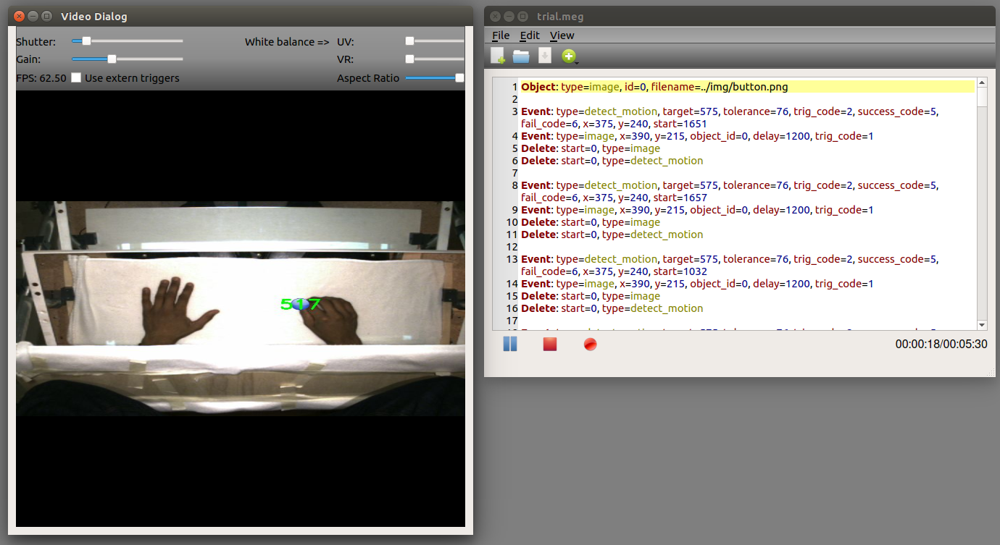

## About

This software is released under the GNU General Public License version 3. 



VidMan is used to control the experimental flow of magnetoencephalography (MEG)
experiments using real-time video feedback of hands as stimulus.

VidMan can be used to:
- Modifify the video feed in real time.
- Control the experiment with scripts specifying event timings and effects.
- Detect movement onset and end from the feed.
- Write trigger signals to the parallel port to detect event/movement onsets from MEG signal.

Thus far, a Stingray F033C FireWire video camera has been used during
the experiments, but any FireWire camera should work.

VidMan syncs trigger codes with vertical blanks, i.e., a trigger code is
written to the parallel port when the front and back buffers are swapped and a
new frame appears on the screen. Some problems with vsync were encountered on
some older Ubuntu versions, but newer versions should be fine. VidMan requires
a graphics card with OpenGL support. Some older Nvidia drivers caused the
software to sometimes hang when using vsync, but this problem should be fixed
on newer drivers. Vsync can be turned off by modifying the config file usually
located at ~/.config/BECS/VidMan.conf and changing the variable vsync to false.
However, vsync is required to make the trigger-to-stimulus delay constant.

## Installation

VidMan requires [Qt 4.8 or higher](https://www.qt.io/) and [OpenCV 3.0 or higher](https://opencv.org)
to compile. Other packages required are `libjpeg-dev` and
`libdc1394-22-dev`, which can be installed via:

```
sudo apt-get install libjpeg-dev libdc1394-22-dev
```

To compile you can either open the project in Qt creator and proceed from there
or from the command line inside the VidMan directory type:

```
qmake CONFIG+=release
make
```

## Usage

VidMan works by applying specific events to each frame captured by the video
camera. The starting time and other parameters of each event must be speficied
in the text editor. To declare an event, the following syntax is used:

```
event: type=flip, start=100, delay=1000, id=1, trigcode=2
```

This declares an event that flips the frame starting 100 ms after the previous
event, and writes the trigger code 2 to the parallel port. By setting delay to
1000, the next event starts 1000 ms after this event, even if its start is set
to 0. To remove an event the following syntax can be used:

```
delete: start=2000, id=1
```

or

```
delete: start=2000, type=flip
```

The former removes the event with id 1, and the latter removes all events of
type flip. The available events with all possible parameters for each are
listed below:

* **flip**: start, delay, id, trig_code
* **fadein**: start, duration, delay, id, trig_code
* **fadeout**: start, duration, delay, id, trig_code
* **image**: start, x, y, object_id, delay, id, trig_code
* **text**: start, string, color, x, y, delay, id, trig_code
* **rotate**: start, angle, delay, id, trig_code
* **freeze**: start, delay, id, trig_code
* **zoom**: start, scale, duration, delay, id, trig_code
* **record**: start, object_id, delay, duration, id, trig_code
* **playback**: start, object_id, delay, duration, id, trig_code
* **detect motion**: start, delay, id, trig_code, trig_code2, success_code, fail_code, x, y, target, tolerance

Duration in milliseconds is used for certain events that modify multiple
subsequent frames. Note the difference between duration and delay. If you want
the next event to take place only after the previous has finished, both should
be set to the same value, e.g.:

```
event: type=fadeout, start=0, duration=5000, delay=5000
event: type=freeze
```

Note also that most parameters are optional. Omitting start, for example, sets
it to the default value of 0. 

Each event has a trigcode parameter which is used to specify the code written
to the serial or parallel port when the event is applied. You need to run the
software as root in order to gain access to the ports. You also need to specify
which port you want to use by choosing menu->edit->use serial port or use
parallel port. The address of the parallel port may have to be changed in the
config file, if the default address is not correct. Motion detection uses two
trigcodes: trigcode is emitted on event onset and trigcode2 when the movement
stops.

To use image, record and playback events, an object needs to declared. For
image use the following syntax:

```
object: type=image, id=0, filename=../img/button.png
```

and for record and playback:

```
object: type=video, id=0, duration=2000
```

Duration is the maximum duration of a video clip in milliseconds. The clip can
then be played with a playback event, e.g.:

```
object: type=video, id=0, duration=2000
event: type=record, start=0, duration=2000, delay=2000, objectId=0
event: type=playback, start=0, duration=2000, objectId=0
```

The detect motion event tracks movement and displays the duration of the
movement in milliseconds. If the duration of the movement is in the interval
target±tolerance, the feedback time is shown in green, otherwise in red. It
works by comparing subsequent frames and counting the number of changes in
pixels. If the number of changes exceeds the threshold value defined in the
config file, the trigger code is sent. Depending on the environment, the
threshold value might need to be adjusted. If there is a lot of background
noise you should increase the value from default 10. The value can be set in
the config file ~/.config/BECS/VidMan.conf by changing the variable
movementThreshold. To check how well the motion detection is working, open the
motion dialog from menu->view->motion dialog.

The script can be paused with `pause`.

## Acknowledgements

VidMan makes use of the following open source projects:


-   [The Helsinki VideoMEG Project](https://github.com/andreyzhd/VideoMEG)
-   [Elementary icons](https://github.com/elementary/icons)
-   [Examples of the Qt Toolkit](http://doc.qt.io/qt-5/qtexamplesandtutorials.html)
